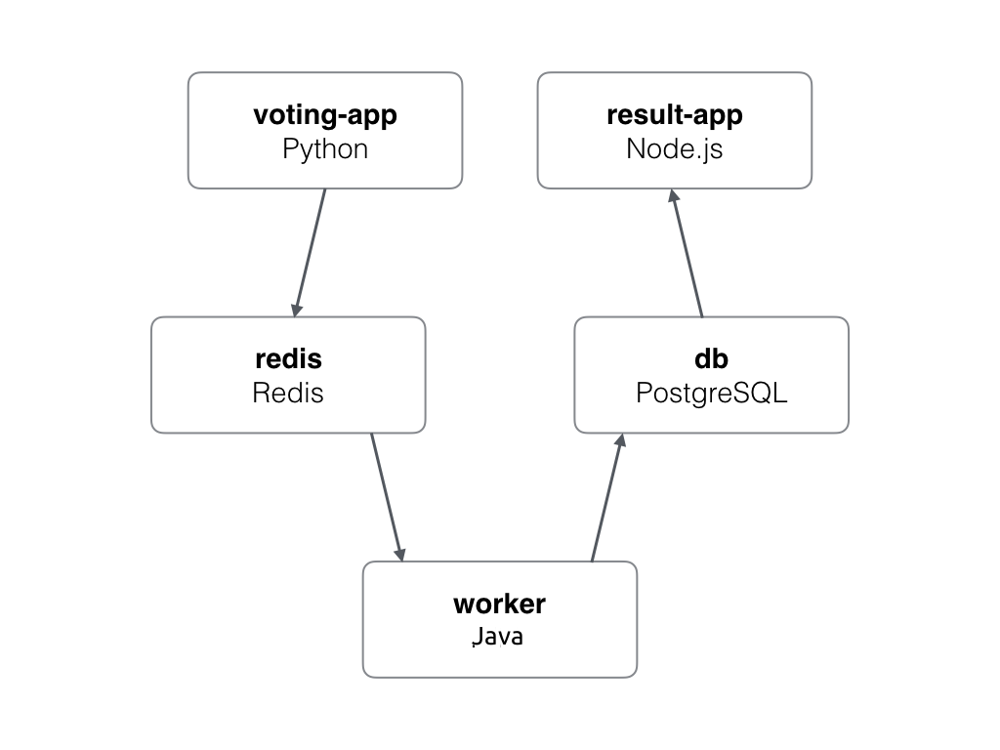
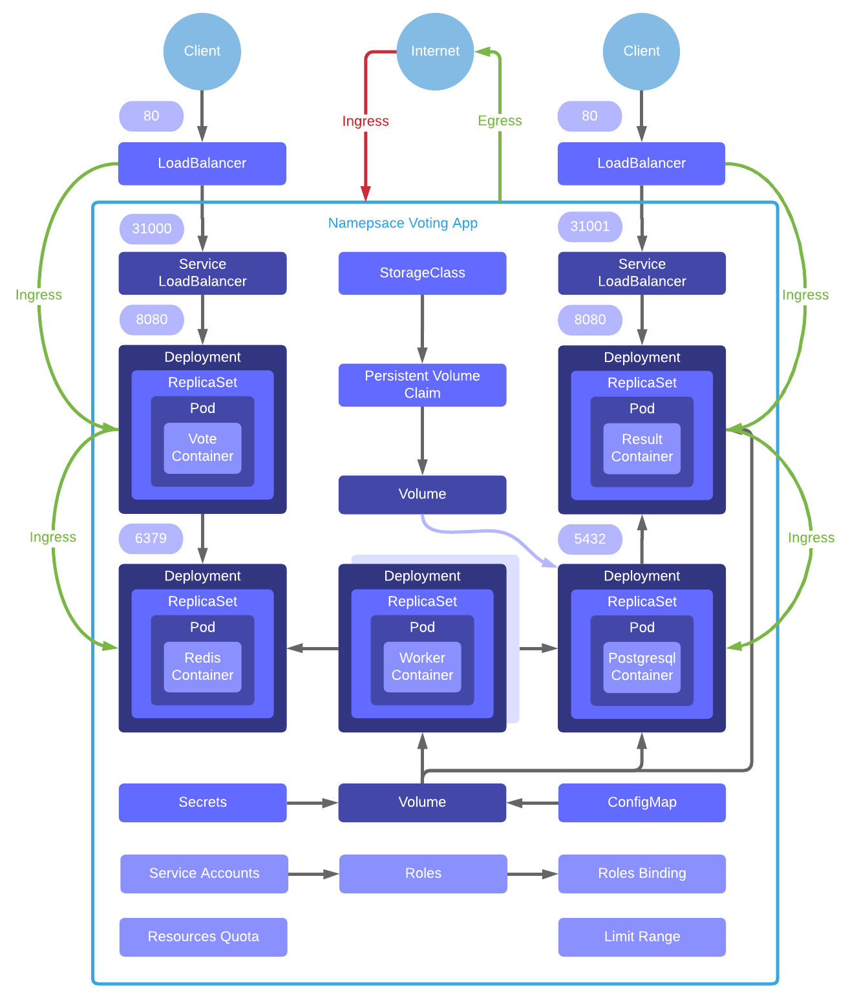

# Voting App

## Description

The voting app is based on that architecture :

* A Python web app which lets you vote between two options
* A Redis queue which collects new votes
* A Java worker which consumes votes and stores them in a PostgreSQL database
* A PostgreSQL database backed by a Docker volume
* A Node.js web app which shows the results of the voting in real time

The architecture can be schematized like this :

Be aware that the voting application only accepts one vote per client. It does not register votes if a vote has already been submitted from a client.

The images build in this project are publicly accessible on [Docker Hub](https://hub.docker.com/u/wikitops/).

## Kubernetes architecture

The purpose of this bootcamp is to explain how to deploy this kind of application in a Kubernetes cluster. The idea is to respect those principles to be able to deploy the Voting App on Minikube, an on premise cluster or a managed cluster like AKS, EKS or GKE easily :

* Portability : The application has to be deployable on any Docker orchestration platform
* Auto / Scalability : Each part of the application has to be scalable to ensure the next principle
* High Availability : The application has to be highly available even across updates
* Persitency : The data collected during the updates has to be persisted to not lose data
* Security : The application has to be deployed in a secure environment

Each part of this architecture is an answer to some principles mentioned previously.

The schema below resume the architecture principles :

### Docker Images

Each part of the application has his own Docker image :

| Service | Pods Name | Image |
| :--- | :--- | :--- |
| Database | db | centos/postgresql-96-centos7 |
| Queue | redis | redis |
| Vote | vote | wikitops/examplevotingapp-vote:1.0 |
| Result | result | wikitops/examplevotingapp-result:1.0 |
| Worker | worker | wikitops/examplevotingapp-worker:1.0 |

## External documentation

Those documentations can help you to go further in this topic :

* The [GitHub repository ](https://github.com/wikitops/example-voting-app)of the project used in this bootcamp
* The [official GitHub repository](https://github.com/dockersamples/example-voting-app) of the Docker Voting App

